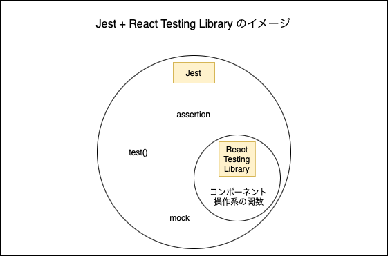

### コンポーネントのテスト方法

- React公式が推奨しているユニットテストの手法
    - Jest + React Testing Library

- Jest: よく使うJavaScriptのテストフレームワーク
    - 多分ロジックのテストとかに使う
    - テストの実行に欠かせないassertion関数やtest()などを提供する

- React Testing Library: 
    - コンポーネントのテストに利用できる
        - 対象のコンポーネントに対して想定される操作を行う関数を提供する

- 大まかなイメージ
    - テストの実行、結果の評価などのテストの根幹の機能はJestが担う
    - コンポーネントのレンダリング、イベントの発火などのUI部分の操作をReact Testing Libraryが提供する

    
---

### 準備

- create-react-app コマンドでプロジェクトを作成した場合、Jest と React Testing Libraryは標準でインストールされる

- 自分で1からReactプロジェクトを用意する場合、別途JestとReact Testing Libraryをインストールする必要がある
```bash
npm install -D jest

# コンポーネントをレンダリングするための関数や要素を見つける関数がまとめられているパッケージ
npm install -D @testing-library/react

# イベントを発火させる関数がまとめられているパッケージ
npm install -D @testing-library/user-event

# コンポーネントの結果評価(matchers)をする関数がまとめられているパッケージ
npm install -D @testing-library/jest-dom
```

#### matchersとは

- Jestを使っていると、結果の評価の際にtoBe()やtoBeTruthy()などを使って結果を評価している。これらの結果評価のための関数をマッチャー(matchers)
と呼ぶ

- @testing-library/jest-dom はJestにはないコンポーネントのためのマッチャーを提供するパッケージ
```js
// expectに渡したコンポーネントがscreenにあることを期待し評価するtoBeInTheDocument()
expect(component).toBeInTheDocument();
```

---

### 基本的な使い方

- "@testing-library/react"のrender関数を使ってテスト対象コンポーネントをレンダリングする

```js
import { render } from "@testing-library/react";
import { Component } from "path of this component";

test("test case1", () => {
    // コンポーネントをレンダリングする
    render(<Component />);
});
```

<br>

- - "@testing-library/react"のscreenオブジェクトは仮想の画面にレンダリングされた要素を検索したり、debugで確認できたりする

```js
import { render, screen } from "@testing-library/react";
import { Component } from "path of this component";

test("test case1", () => {
    render(<Component />);

    // 引数の文字列を持つ最初の要素を取得する
    const msgElem = screen.getByText("Hello");
    
    // 仮想の画面にどのような構造でdomがレンダリングされているか確認できる
    screen.debug();

});
```

<br>

- Jestや@testing-library/jest-domで提供されているmaxtchersを利用して結果を評価する
```js
import { render, screen } from "@testing-library/react";
import { Component } from "path of this component";

test("test case1", () => {
    render(<Component />);
    const msgElem = screen.getByText("Hello");

    // @testing-library/jest-domが提供する関数で指定するクラス名が付与されているかをチェックする
    expect(msg.Elem).toHaveClass('message');
});

```

---

###  ユーザーイベントを発火させる

- [参照元](https://zenn.dev/k_log24/articles/4c1cd37ff0ca50)

- "@testing-library/user-event"にある fireEvent オブジェクトからユーザーイベントを発火できる
```js
import { fireEvent } from '@testing-library/react';

fireEvent.click(screen.getByRole('button'));
```

<br>

- "@testing-library/react"にある userEvent オブジェクトからもユーザーイベントを発火できる
```js
import userEvent from '@testing-library/user-event';

userEvent.click(screen.getByRole('button'));
```

<br>

- fireEventとuserEventのどちらがいいのか
    - 特に制約がなければuserEventを使ったほいがいい
        - 理由1: Testing Library公式でそう勧められているから
        - 理由2: userEventの方が簡潔に書けるらしい
        - 理由3: 実際のユーザーの操作により近いのはuserEventの方だから

- 上記の詳しい解説

    - 公式での説明は[こちらを参照](https://testing-library.com/docs/dom-testing-library/api-events/)

    - userEventの方が簡潔に書ける例
    ```js
    // input項目に対してtestという文字を入力する

    // fireEvent
    fireEvent.change(screen.getByRole('textbox'), { target: { value: 'test' } });

    // userEvent
    userEvent.type(screen.getByRole('textbox'), 'test')
    ```

    - fireEventとuserEventの明確な違い
        - fireEventはdisableなインプット項目に対してもinputイベントを発火できてしまう(ユーザーはそのような操作はできないのにも関わらず)

        - userEventはdisableなインプット項目に対してinputイベントを発火できない(実際のユーザーと同じ状況での操作)