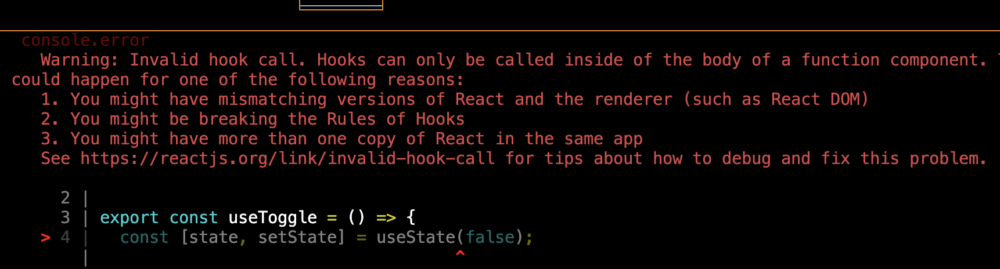

### カスタムフックのテスト方法

- React18 からは @testing-library/react の renderHook を利用することでテスト可能になる

---

### 最初に書いた間違ったフックスのテスト

```js
// useToggle.js
// 状態をトグルするフック (今回のテスト対象)
import { useState } from "react";

export const useToggle = () => {
  const [state, setState] = useState(false);

  const change = () => {
    setState((prev) => !prev);
  };

  return { state, change };
};
```

```js
// useToggle.test.js (テストコード)
import { useToggle } from "../hooks/useToggle";
import { waitFor } from "@testing-library/react";

test("hooks test sample", async () => {
  const { state, change } = useToggle();

  // 初期値はfalseであることを確認する
  expect(state).toBeFalsy();
  // state(真偽値)を反転する
  change();
  // trueになっていることを確認する
  await waitFor(() => {
    expect(state).toBeTruthy();
  });
});

```

<br>

結果: hooks は コンポーネント内で呼び出せというエラーが吐かれて fail になる

-> useToggle (カスタムフック) 内でuseState を使っており、 useState などのフックスは関数コンポーネント内に書かないとエラーになる



---


### ではどのようにフックのテストをするのか?

- @testing-library/react の renderHook で　疑似的な関数コンポーネントを作るっぽい

- renderHook の引数にコールバックの戻り値としてカスタムフックを渡す

- 結果は renderHookの戻り値オブジェクト.result から参照できる

```js
// useToggle.test.js (テストコード)
import { useToggle } from "../hooks/useToggle";
import { renderHook } from "@testing-library/react";

test("hooks test sample", async () => {

    // 疑似的コンポーネントにカスタムフックを渡す
    const { result } = renderHook(() => usetoggle());

    // stateの初期値はfalseであることを確認
    expect(result.current.state).toBe
});
```

#### result とは

- result とは、renderHook から返されるオブジェクｔ

- result オブジェクトの current プロパティにカスタムフックからの戻り値が格納される

- よって上記テストコードの result オブジェクトの構造は以下のようになる

```js
// useToggle.test.js (テストコード)

const { result } = renderHook(() => usetoggle());
/**
 * result = {current: {state, setState}}
 */
```

#### set~ でstateを変更する

```js
// useToggle.test.js (テストコード)

import { useToggle } from "../hooks/useToggle";
import { renderHook } from "@testing-library/react";

test("hooks test sample", async () => {

    // 疑似的コンポーネントにカスタムフックを渡す
    const { result } = renderHook(() => usetoggle());

    // stateの初期値はfalseであることを確認
    expect(result.current.state).toBeFalsy();

    // changeでstate(真偽値)を反転する
    result.current.change();

    // stateがtrueになっていることを確認する
    expect(result.current.state).toBeTruthy();
});
```

<br>

*テストは通るが以下の警告が表示される
  - An update to TestComponent inside a test was not wrapped in act...

    -> setState　は非同期で処理が行われるので、actで囲めという警告

よって、テストコードを以下のように修正して完成

```js
// useToggle.test.js (テストコード)

import { useToggle } from "../hooks/useToggle";
import { renderHook, act } from "@testing-library/react";

test("hooks test sample", async () => {

    // 疑似的コンポーネントにカスタムフックを渡す
    const { result } = renderHook(() => usetoggle());

    // stateの初期値はfalseであることを確認
    expect(result.current.state).toBeFalsy();

    act(() => {
      // changeでstate(真偽値)を反転する
      result.current.change();
    });

    // stateがtrueになっていることを確認する
    expect(result.current.state).toBeTruthy();
});
```

---

### 配列を返すカスタムフックのテストに注意

- もしカスタムフックが以下のように配列で変数や関数を返している場合

```js
// useToggle.js
// 状態をトグルするフック (今回のテスト対象)
import { useState } from "react";

export const useToggle = () => {
  const [state, setState] = useState(false);

  const change = () => {
    setState((prev) => !prev);
  };

  // もしここで配列を返している場合

  return [state, change ];
};
```

```js
// useToggle.test.js (テストコード)

import { useToggle } from "../hooks/useToggle";
import { renderHook } from "@testing-library/react";

test("hooks test sample", async () => {

    // 疑似的コンポーネントにカスタムフックを渡す
    const { result } = renderHook(() => usetoggle());
});
```

<br>

- この時の renderHook　の戻り値のresultプロパティは以下のようになる

```js
// renderHookの戻り値のオブジェクト.resultの中身
result　=  {"current":[false,null]}
```

<br>

- つまり、result.currentは配列になるので、以下のようなプロパティ値での指定はできなくなり、添え字での指定になる

```js
// ×
result.current.state;
result.current.change();

// ○
result.current[0];
result.current[1];
```

<br>

- よって、サンプルのテストコードは以下のように修正されなければいけなくなる

```js
// useToggle.test.js (テストコード)

import { useToggle } from "../hooks/useToggle";
import { renderHook, act } from "@testing-library/react";

test("hooks test sample", async () => {

    // 疑似的コンポーネントにカスタムフックを渡す
    const { result } = renderHook(() => usetoggle());

    // stateの初期値はfalseであることを確認
    // expect(result.current.state).toBe
    expect(result.current.[0]).toBeFalsy();

    act(() => {
      // changeでstate(真偽値)を反転する
      // result.current.change();
      result.current.[1]();
    });

    // stateがtrueになっていることを確認する
    // expect(result.current.state).toBeTruthy();
    expect(result.current[0]).toBeTruthy();
});
```