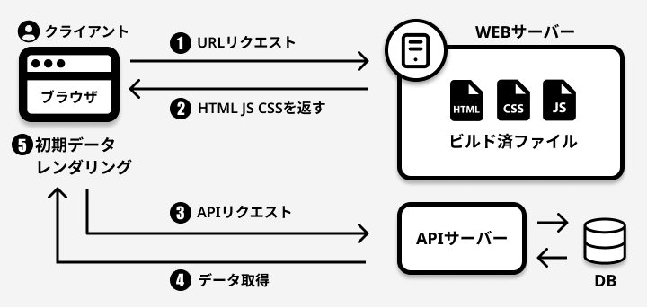
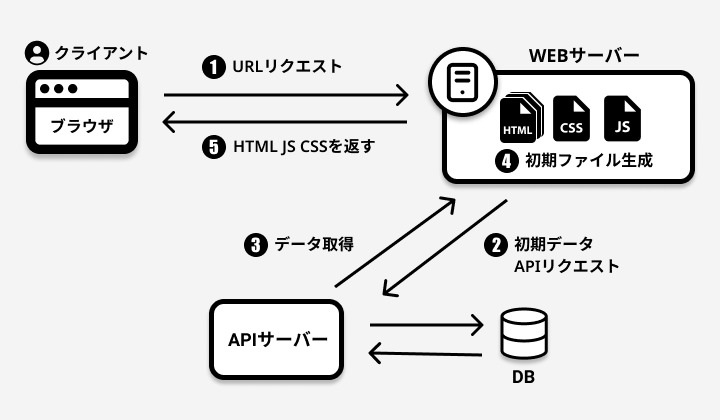
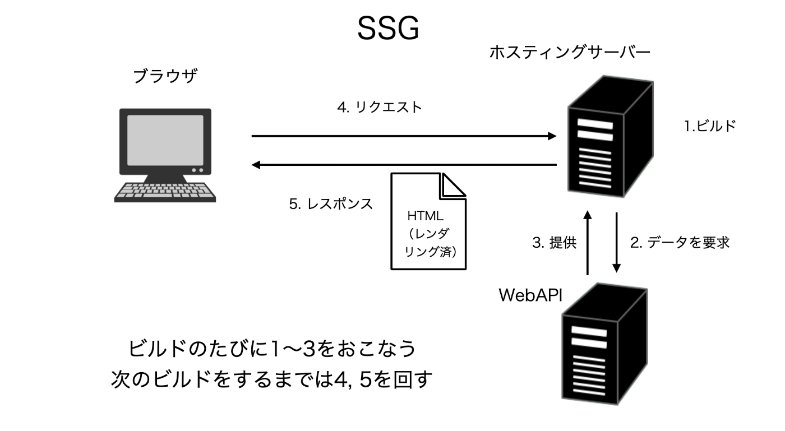

### 様々な種類のレンダリング方法  

### CSR(SPA)とは  
- Client Side Renderingの略  

    プレーンなReactのように  

    - クライアントが画面のリクエストをする  

    - サーバーが空のHTMLやcss/jsファイルを返す  

    - クライアント側で(apiを叩くなどして)表示データを取得する  
    
    - 取得したデータをクライアント側でレンダリングし、画面を表示する  

    **空のHTML取得/css/jsファイルの取得は初回画面表示時のみ**

    **以降の画面遷移/画面操作時は: APIでのデータ取得　→ クライアント側でのレンダリング を行なっていく**

    **CSRで配信されているアプリケーションを一般的にSPAと呼ぶ**

 

 

- CSRのメリット
    - ページ遷移がはやい(ページ全体を読み込まないため)
- CSRのデメリット
    - 初回画面がほぼからなので、クローラーに引っかからず,SEO面で不利
    - (多くのファイルがあったり、ファイルサイズが大きいと)初回の画面表示が遅くなる可能性がある

 

### SSRとは
- Server Side Renderingの略  

    サーバー側で画面をレンダリングし、クライアントにレンダリング済みのHTMLを返す仕組み

    - クライアント側で画面をリクエスト  

    - サーバー側(NodeJS)で画面表示に必要なデータをapiを叩くなどしてリクエスト

    - サーバー側(NodeJS)で取得したデータをもとに画面(HTML)を作成

    - 作成されたHTMLをクライアントに返却する

 

 

- SSRのメリット
    - SEOで不利になることはない
    - クライアント側の端末スペックを気にする必要があまりない
    - 重い処理はサーバー側で担ってくれる

- SSRのデメリット
    - 画面遷移はCSRよりは遅くなるかも
    - Node.jsサーバを実行できる環境が必要  
    - サーバー側の負荷が増加

- そのほかの特徴
    - HTML作成のタイミングは、リクエストが来たタイミング

 

### SSGとは  

- Static Site Generatorの略  

    プロジェクトビルド時にHTMLを生成しておき、そのhtmlを再利用する方法

    - ビルド時にhtmlをサーバー側で生成

    - その際に、必要なデータがあれば、DBなどから取得する

    - クライアントのリクエストに応じて、生成済みのhtmlを返却する　

    

 

- SSGのメリット
    - すでにサーバー側で生成されているhtmlが返ってくるので、SSRよりもページの表示が早い
    - SEOで不利になることはない
    - ユーザーリクエストの際のサーバー側の負荷が減る(いちいちhtml作成を行わなくてよいため)

- SSGのデメリット
    - ビルド時にhtmlページに必要なデータの取得が取得されるので、リクエスト時点での最新情報などはページに反映されない
    - 大規模になればなるほど、ビルドの時間が長くなる

- そのほかの特徴
    - HTML作成のタイミングは、プロジェクトのビルド時
