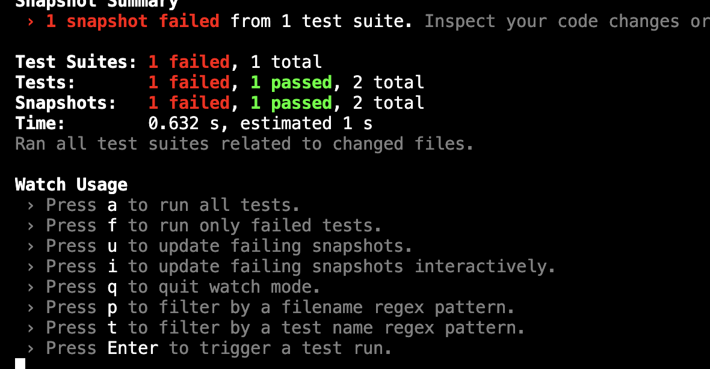

### Snapshot Test とは

- フロントエンドのテストの一つの種類
    - 一つは馴染みのあるアサーションテスト
    - もう一つがスナップショットテスト

- 概要
    - 初回テスト実行時にスナップショットをとる
    - 以降のテストにて、初回に記録したスナップショットとテスト実行時のコンポーネントの構造の差分をチェックする

- 何が嬉しいのか
    - デグレの確認が楽になる => いちいち1要素ごとにアサーションを書かなくて良くなる

- デメリット
    - なんのためのテストなのか、コードから読み取りにくい
    - 仕様変更などによってコンポーネントの修正を行った場合でも、スナップショットテストは失敗する(コンポーネントの構造を変更した場合)

---

### スナップショットテストの方法

- render() の戻り値であるオブジェクト.container を利用する

- マッチャーの toMatchSnapshot() を利用する

```js
expect(render().container).toMatchSnaphot();
```

<br>

例: 以下のようなタイトルだけを持つコンポーネントがあるとする

```js
// テスト対象コンポーネント
export const MyComponent = () => {
    return (
        <>
            <h1>Title</h1>
        </>
    );
}
```

```js
// テストコード
test("snapshot test", () => {
    const view = render(<MyComponent/>)
    expect(view.container).toMatchSnapshot();
});
```

<br>

実行後は \_\_snapshot\_\_ というディレクトリが作成され、そこにスナップショットのファイルが格納される
```
project
    |- __snapshot__
        |- snapshot file
```

<br>

のちの開発で、不用意にも MyComponent をいじってしまった(デグレ)

```js
// テスト対象コンポーネント
export const MyComponent = () => {
    return (
        <>
            {// 間違ってh2にしてしまった}
            <h2>Title</h2>
        </>
    );
}
```

テストを実行すると snapshot test に失敗する  
-> 初回実行時に取得したスナップショットと違うから

```js
// テストコード
test("snapshot test", () => {
    const view = render(<MyComponent/>)
    expect(view.container).toMatchSnapshot();
    // fail
});
```

#### <font color="red">変更が正しかった場合</font>    
    - 上記例だと、 MyModule にて h1 -> h2 に変更が正しい変更だった場合  
    
        -> スナップショットを更新する必要がある

    - 下のいずれかの方法で過去のスナップショットを更新できる

        1. jest コマンドに --updateSnapshot (-u) オプションをつける
        ```bash
        npx jest -u
        ```

        2. jest の watch モードにて u キーでスナップショットを更新する
        

        3. npm run test コマンドに -u オプションを渡す
        ```bash
        npm run test -- -u
        ```

---

### インラインスナップショットテスト

- 通常のスナップショットテストはスナップショットの記録を外部ファイル (\_\_snapshot\_\_配下) に保存していた。

- しかし、 inline snapshot は　テストコードを直接変更することによって、対象コンポーネントのスナップショットを記録する

- インラインスナップショットには、マッチャーに toMatchInlineSnapshot() を利用する

```js
// テスト対象コンポーネント
export const MyModule = () => {
    return (
        <h1>
            Hello
        </h1>
    );
};
```

```js
// テストコード
test("inline snapshot test", () => {
    const { container } = render(<MyModule />);
    expect(container).toMatchInlineSnapshot();
});
```

テスト実行後

```js
// テストコード
test("inline snapshot test", () => {
    const { container } = render(<MyModule />);
    expect(container).toMatchInlineSnapshot(`
<h1>
  Hello
</h1>
`);
})
```

次回のテストから、テストコードに記録された(ベタ書きされた)スナップショットを比較する

#### インラインスナップショットを使うにあたって

- 小さいコンポーネンを対象にする  
    -> 大きいコンポーネントだと、ソースコードが肥大化する

- 利点はわざわざスナップショットファイルを開かなくて済むことぐらいなので、普通のスナップショットテストをする方がいい

- インラインスナップショットの際にエラーが発生することがある。[詳しくはこちら](./issue/toMatchInlineSnapshot.md)

---

### その他

#### Git での管理について
- スナップショットファイル (\_\_snapshot\_\_　配下のファイル) はコミットする  
    -> CIツールにて利用できるらしい