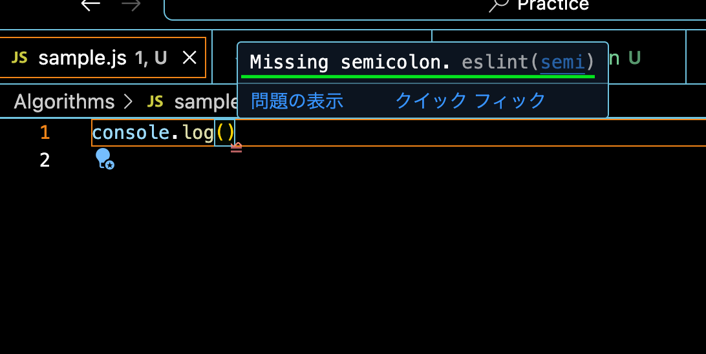

### Prettier とは

- コードの自動整形ツール
  - インデントを揃えたりコードの見た目を綺麗に整えるツール  
    \*ESLint もコード整形機能を持っているが、Prettier のコード整形機能の方が優れているらしい。  
    ESLint はそもそもコードの静的解析ツール

---

### VSCode で prettier を使う

1. npm install で prettier をインストール
2. vscode のプラグインで prettier をインストール
3. .prettierrc(設定ファイル)を作成する
4. .prettierignore を作成する
5. VSCodeのsetting.jsonにデフォルトのフォーマッターの指定と、保存時にフォーマットをかける指定をしておく

```json
// setting.jsonにて下記を追加する
{
    "editor.defaultFormatter": "esbenp.prettier-vscode",
    "editor.formatOnSave": true
}
```

\*これだけではうまくいかないことがあるので[下記を参照](#sec3)

---

<a id="sec3"></a>

### 注意事項

- prettier と ESLint(Linter)が競合する可能性がある
  - ESLint のルールと prettier のルールによっては矛盾(競合)が起きる

例

```json
// .prettierrc側
{
    // 行の最後にセミコロンをつけない
    "semi": false
}

// .eslintrc側
{
    "rules": {
        // 文末セミコロンは省略しない
        "semi": 2
    }
}
```

prettier ではコード整形時にセミコロンをつけないようにするのに対し、ESLint ではセミコロンがないと警告を出すように設定してある



<br>

- 静的解析は Linter, コードの整形は Prettier といった形で、棲み分けをさせたい

<br>

上記の問題を解決するために、 下記の手順を踏む

1. eslint-config-prettier をインストールする
```bash
npm install -D eslint-config-prettier
```
*eslint-config-prettier とは prettier と競合するeslintのルールを無効化するeslint用のプラグイン

2. インストールした上記プラグインのプリセットをESLint側で適用する
```json
// .eslintrc
{
    "extends":[
        // その他の設定
        "prettier" // これは最後に適用する
    ]
}
```
*prettierを最後に適用しないと、prettierで無効にした設定が、ほかのプリセットで有効に上書かれるかもしれないから